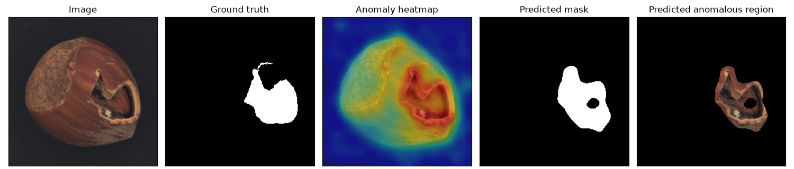
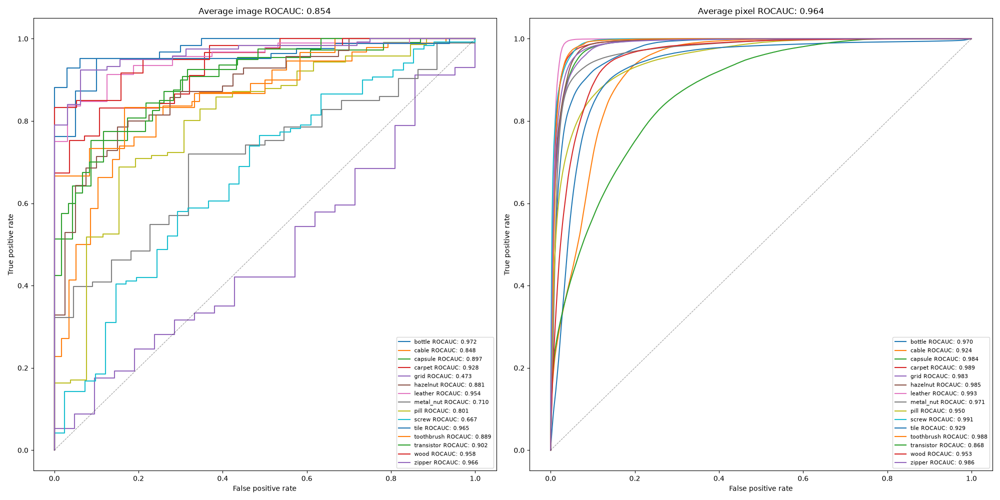

# Industrial Defect Detection & MLOps Pipeline

[](https://github.com/miachillgood/industrial-defect-detection-mlops/actions/workflows/ci.yml)
[](https://www.python.org/downloads/)
[](LICENSE)

I built a **surface-defect detection system trained on defect-free samples only**: give it a photo of a part and it answers "is this defective?" and "which pixels exactly?". Around it I put a full production-shaped pipeline — DVC for data/model versioning, MLflow for experiment tracking, a FastAPI inference service, a Streamlit human-review loop, Docker, and GitHub Actions CI.

Across all 15 MVTec AD categories I get **85.41 % image-level ROC-AUC** and **96.44 % pixel-level ROC-AUC**.



<sub>Left to right: input · ground-truth mask · anomaly heatmap · predicted mask · localised defect. The model never saw a single defective sample during setup.</sub>

---

## Why unsupervised

Defective samples are scarce on a production line, and the defect taxonomy is open-ended — the scratch, chip, or misalignment you have never seen will show up tomorrow anyway. A supervised detector would keep missing new defect types under that distribution, and every new product line would mean collecting and labelling a fresh batch of bad parts.

So I let the system learn only what **normal** looks like: a frozen ImageNet backbone encodes defect-free samples into a multi-scale feature bank (memory bank), a test image gets an anomaly score by nearest-neighbour retrieval, and a per-pixel correspondence over the feature pyramid localises the defect.

Three engineering consequences follow directly from that choice:

- **No weights to train.** Switching product lines means rebuilding the feature bank from a new set of normal samples — minutes, no hyper-parameter tuning, no waiting for convergence.
- **The decision threshold is a product decision, not a training outcome.** How to trade false negatives against false positives belongs to the business; the review tool I built exists to tune it.
- **Decisions are explainable.** Every verdict ships with a heatmap and a defect mask, so an inspector can see where the model is looking.

---

## What I built

| | |
| --- | --- |
| **Detection** | Wide-ResNet50-2 feature pyramid + kNN retrieval + deep pyramid correspondence, image-level and pixel-level output |
| **Evaluation** | Image / pixel ROC-AUC, PRO, ROC curves, per-category localisation figures |
| **Data versioning** | DVC tracks the 5 GB dataset and the multi-hundred-MB feature bank; git holds only hash pointers |
| **Experiment tracking** | MLflow records params, per-category metrics, and all artifacts — and **a tracking failure never breaks a run** |
| **Inference service** | FastAPI, lazy per-category bank loading, returns score + base64 heatmap + mask |
| **Human-in-the-loop** | Streamlit review console, append-only JSONL decisions, live view of how the threshold changes verdicts |
| **Delivery** | Multi-stage Dockerfile (CPU-only torch, non-root, baked-in weights) + docker-compose |
| **CI** | ruff, a Python 3.11/3.12 test matrix, API image smoke test |

The dataset is [MVTec Anomaly Detection (MVTec AD)](https://www.mvtec.com/company/research/datasets/mvtec-ad): 15 categories of industrial products and materials, 3 629 training images + 1 725 test images.

---

## Method

Two stages, and **no parameter is ever updated**.

### Stage 1 · Image-level retrieval

Each image is summarised by the 2048-d global average-pooled Wide-ResNet50-2 descriptor. A test image's anomaly score is the mean Euclidean distance to its **K nearest normal samples**:

```
score(x) = mean( topK_min ‖ f_avg(x) − f_avg(t_i) ‖₂ ,  t_i ∈ normal bank )
```

### Stage 2 · Pixel-level deep pyramid correspondence

Reusing the same K neighbours, I flatten their feature vectors at **every spatial position** across `layer1 / layer2 / layer3` into one gallery. Each test position scores as its distance to the closest gallery vector; the three scales are bilinearly upsampled to 224×224, averaged, and smoothed with a σ=4 Gaussian.

Resolutions: `layer1` 56×56 (256 channels), `layer2` 28×28 (512), `layer3` 14×14 (1024). At K=5 the `layer1` gallery is 5×56×56 = 15 680 vectors of dimension 256.

I default to `K=5`; a larger K means a larger gallery and steadier localisation, at proportionally higher cost.

---

## Results

<!-- RESULTS:BEGIN -->
<!-- source: artifacts/runs/full-mvtec-k5/results.json -->
All 15 MVTec AD categories, `K=5`, `wide_resnet50_2` (ImageNet **IMAGENET1K_V1** weights, frozen throughout):

| | Image ROC-AUC | Pixel ROC-AUC | PRO |
| --- | ---: | ---: | ---: |
| **This project (K=5)** | **85.41 %** | **96.44 %** | **86.13 %** |
| Public baseline `byungjae89/SPADE-pytorch` (K=5) | 85.4 % | 96.4 % | — |
| Paper (K=50) | 85.5 % | 96.5 % | — |
| Delta vs. public baseline | +0.01 | +0.04 | — |

PRO (per-region overlap, integrated to FPR <= 0.3) weights every defect region equally, unlike pixel ROC-AUC which large defects dominate. Neither the public baseline nor the paper reports it, so there is no reference column.

<details>
<summary>Per-category detail (click to expand)</summary>

| category | image (baseline) | image (ours) | Δ | pixel (baseline) | pixel (ours) | Δ | PRO |
| --- | ---: | ---: | ---: | ---: | ---: | ---: | ---: |
| bottle | 97.2 | 97.22 | +0.02 | 97.0 | 97.01 | +0.01 | 93.33 |
| cable | 84.8 | 84.84 | +0.04 | 92.3 | 92.41 | +0.11 | 73.51 |
| capsule | 89.7 | 89.67 | -0.03 | 98.4 | 98.39 | -0.01 | 90.21 |
| carpet | 92.8 | 92.78 | -0.02 | 98.9 | 98.91 | +0.01 | 80.83 |
| grid | 47.3 | 47.28 | -0.02 | 98.3 | 98.35 | +0.05 | 86.39 |
| hazelnut | 88.1 | 88.14 | +0.04 | 98.5 | 98.53 | +0.03 | 93.39 |
| leather | 95.4 | 95.38 | -0.02 | 99.3 | 99.32 | +0.02 | 97.37 |
| metal_nut | 71.0 | 70.97 | -0.03 | 97.1 | 97.14 | +0.04 | 86.76 |
| pill | 80.1 | 80.14 | +0.04 | 95.0 | 94.98 | -0.02 | 91.78 |
| screw | 66.7 | 66.71 | +0.01 | 99.1 | 99.11 | +0.01 | 93.45 |
| tile | 96.5 | 96.50 | +0.00 | 92.8 | 92.88 | +0.08 | 69.14 |
| toothbrush | 88.9 | 88.89 | -0.01 | 98.8 | 98.85 | +0.05 | 91.74 |
| transistor | 90.3 | 90.25 | -0.05 | 86.6 | 86.75 | +0.15 | 70.76 |
| wood | 95.8 | 95.79 | -0.01 | 95.3 | 95.33 | +0.03 | 91.66 |
| zipper | 96.6 | 96.59 | -0.01 | 98.6 | 98.59 | -0.01 | 81.67 |
| **Mean** | **85.4** | **85.41** | **+0.01** | **96.4** | **96.44** | **+0.04** | **86.13** |

</details>

> Environment: macOS-26.5.2-arm64-arm-64bit-Mach-O, PyTorch 2.13.0, device `mps`, 19.4 min end to end.
> The method neither trains nor samples, so repeated runs in the same environment are bit-for-bit identical.

`grid` scores 47 % at image level -- below chance. That is not a bug but a known weakness of the method; the public baseline reports 47.3 % too. See [docs/method.md](docs/method.md#6-expected-variation).
<!-- RESULTS:END -->



### How K matters: I measured the paper's K=50 too

The "Paper (K=50)" row above started out as a number I had merely copied. So I ran all 15 categories at `K=50` (`artifacts/runs/full-mvtec-k50/`). The result splits in two:

| | Image ROC-AUC | Pixel ROC-AUC | Wall clock |
| --- | ---: | ---: | ---: |
| Paper's own figures (K=50) | 85.5 | 96.5 | — |
| Mine, K=5 | **85.41** | 96.44 | 19.4 min |
| Mine, K=50 | 80.88 | **96.98** | 91.1 min |

- **Pixel level: K=50 is better** — 96.98, a further 0.48 above the paper's own 96.5. Localisation benefits from the 10× larger gallery.
- **Image level: K=50 loses 4.53 points**, moving *away* from the paper's 85.5. The 85.5 the paper reports at K=50 is only reproducible in this implementation at K=5. **This is something I could not reproduce, and I am recording it rather than glossing over it.**

I got the explanation wrong on the first try. My guess was "K=50 covers too large a fraction of a small training set", but K/n_train correlates with the drop at only −0.19, and in the wrong direction. The hypothesis that holds is "categories whose image-level score was already weak at K=5 degrade most", with correlation **+0.785** — the 8 categories below 90 lose 7.57 points on average, the 7 at or above 90 only 1.05. K=50 introduces no new failure; it averages what little signal there was across 50 neighbours. Details in [docs/method.md](docs/method.md#7-how-k-matters-measuring-the-papers-k50).

---

## Quick start

```bash
make venv && make install
```

### 1. Prepare the data (~5 GB)

MVTec AD is released under CC BY-NC-SA 4.0 for non-commercial research only. Please read and accept the licence on the [official page](https://www.mvtec.com/company/research/datasets/mvtec-ad) first.

```bash
make data
```

`scripts/prepare_data.py` accepts a mirror URL or a local archive, then verifies the per-category image counts after extraction and exits non-zero if anything is missing:

```bash
python scripts/prepare_data.py --archive ~/Downloads/mvtec_anomaly_detection.tar.xz
python scripts/prepare_data.py --check-only   # verify layout and counts only
```

### 2. Run all 15 categories

```bash
make eval
make eval-quick     # single-category smoke run (bottle)
```

Outputs land in `artifacts/runs/<run-name>/`: `results.md` (comparison tables), `results.json`, `metrics.json`, `roc_curve.png`, and `images/` (localisation figures).

### 3. Build a deployable memory bank

```bash
make bank           # bottle by default -> artifacts/banks/spade_bottle.pt
```

Thresholds are calibrated **inside the training split** by leave-one-out: score each normal image against its K nearest neighbours excluding itself, take the resulting normal-score distribution, and pick a percentile (image-level P99, pixel-level P99.5 by default). **The test split is never touched**, so the ROC-AUC figures above are not contaminated by threshold calibration.

### 4. Run the services

```bash
make api            # FastAPI   -> http://localhost:8000/docs
make review         # Streamlit -> http://localhost:8501
make mlflow         # MLflow UI -> http://localhost:5000
```

All at once:

```bash
docker compose -f docker/docker-compose.yml up --build
```

> If the repository path contains non-ASCII characters, `docker compose build` fails with a gRPC "non-printable ASCII char" error — a Compose/buildx limitation, not a Dockerfile problem. Build with `docker build` and start with `--no-build`; see [docs/mlops.md](docs/mlops.md#known-limitation-a-non-ascii-path-breaks-docker-compose-build).

Calling the inference API:

```bash
curl -s -F 'file=@data/mvtec_anomaly_detection/bottle/test/broken_large/000.png' \
  'http://localhost:8000/predict?category=bottle&include_images=false' | jq
```

| Endpoint | Purpose |
| --- | --- |
| `GET /health` | Liveness probe + loaded categories |
| `GET /models` | Per-bank metadata and calibration details |
| `GET /stats` | Request count, anomaly count, mean latency |
| `POST /predict` | Score, verdict, base64 heatmap and mask |
| `POST /predict/overlay` | The blended overlay straight back as a PNG |

---

## Architecture

```
prepare_data ──► evaluate ──► build_bank ──► FastAPI service
     │              │              │              │
    DVC           MLflow          DVC        Streamlit review
 (data version) (experiments)  (model version)  (human feedback)
                                                  │
                                 threshold recalibration ◄───┘
```

The premise behind this pipeline: **the method has no checkpoint** — the "model" is a frozen backbone plus a bank of normal-sample features. What needs versioning is therefore **data**, not weights, which is exactly why I reached for DVC rather than a model registry. Change `evaluate.top_k` in `params.yaml` and `dvc repro` re-runs only `evaluate` and `build_bank`, not the data verification.

I made the MLflow layer **fail-soft on purpose**: whether MLflow is installed or its server is reachable, `make eval` must still finish and write `results.json`. Tracking is observation, not a runtime dependency.

---

## Layout

```
src/spade/            detection core
  config.py           hyper-parameters and device selection
  data.py             MVTec AD dataset and pre-processing
  features.py         Wide-ResNet50-2 feature pyramid (forward hooks)
  model.py            kNN retrieval + deep pyramid correspondence
  metrics.py          ROC-AUC / PRO / published baseline tables
  evaluate.py         per-category evaluation and report generation
  inference.py        single-image inference (shared by API and review tool)
  cache.py            on-disk feature cache
  visualize.py        ROC curves and localisation figures
src/mlops/            engineering layer
  tracking.py         MLflow wrapper (fail-soft)
  review_store.py     human review decisions (append-only JSONL)
apps/api/             FastAPI inference service
apps/streamlit/       annotation review tool
scripts/              data preparation, bank building, README result sync
docker/               Dockerfile + docker-compose
tests/                unit tests and documentation attribution guards
docs/                 method details, engineering notes
```

---

## Four traps I hit and handled explicitly

The full list is in [docs/method.md](docs/method.md); these four matter most:

1. **`torch.pairwise_distance` changed its reduction axis in PyTorch 2.x.**
   On PyTorch 1.x it reduced over `dim=1` (channels); from 2.0 it reduces over the **last** axis — the same line **silently** computes a completely different quantity on a modern install, with no error. I reduce over the channel axis explicitly and pin the semantics with `tests/test_model.py::test_channelwise_reduction_is_the_intended_distance`, so nobody "simplifies" it back to the built-in.

2. **The ImageNet weights must be `IMAGENET1K_V1`.**
   The V2 weights torchvision added later were retrained with an improved recipe; the feature distribution differs and every number moves. I hard-code V1 in `features.py` and raise on an unsupported backbone rather than silently degrading.

3. **`Image.ANTIALIAS` is LANCZOS, not bilinear.**
   The `Resize(256)` in pre-processing must use LANCZOS resampling; switching to the default bilinear shifts results systematically.

4. **The public baseline's gallery loop uses integer division and silently drops the tail.**
   `range(gallery_size // 100)` discards the last `G % 100` rows (at K=5, 80 of layer1's 15 680). I use the full gallery by default — but I did not stop at "the effect is probably small". I ran both modes over all 15 categories: with the truncation enabled the pixel-level mean lands exactly on the baseline's published **96.40**, mean absolute per-category deviation halves from 0.042 to 0.021, and `transistor` — my worst category at 0.15 — drops to 0.02. **So that 0.15 was mostly this quirk, not floating-point noise.** Image level is untouched (its score comes from avgpool and never passes through the gallery).

   The default stays on the full gallery: matching the baseline more closely is not the same as being more correct, and that 0.04 is a replicated implementation defect. `--drop-gallery-remainder` exists to make the source of the difference auditable, not to farm a better number. Both runs are committed under `artifacts/runs/`.

---

## Documentation

- [docs/method.md](docs/method.md) — method and implementation detail: the two stages, a line-by-line configuration checklist against the baseline, the four traps with measured comparisons, metric definitions, expected variation, the K=50 study, environment
- [docs/mlops.md](docs/mlops.md) — engineering layer: the DVC pipeline, MLflow tracking, FastAPI/Streamlit design trade-offs, Docker and CI

---

## Credits

The detection method I implemented comes from Niv Cohen and Yedid Hoshen, [Sub-Image Anomaly Detection with Deep Pyramid Correspondences](https://arxiv.org/abs/2005.02357) (arXiv:2005.02357), known as SPADE. The code in this repository is my own; to make the numbers above checkable by anyone, I aligned the configuration and hyper-parameters with the community implementation [`byungjae89/SPADE-pytorch`](https://github.com/byungjae89/SPADE-pytorch) (MIT License) and compared per category against the 85.4 % / 96.4 % it publishes at `K=5`. The paper's own means are 85.5 % / 96.5 % (`K=50`).

> **Attribution note:** `byungjae89/SPADE-pytorch` is a third-party PyTorch implementation, **not** code released by the paper's authors — no public repository from them was found. The accurate phrasing for this project is therefore "reproduced from the SPADE paper and the `byungjae89/SPADE-pytorch` open-source implementation". `tests/test_docs_attribution.py` enforces this in CI.

> **Do not confuse the acronym:** [NVlabs/SPADE](https://github.com/NVlabs/SPADE) is a **completely unrelated** method — spatially-adaptive normalization for image synthesis (GauGAN). It has nothing to do with industrial anomaly detection; the acronym collision is the only connection.

```bibtex
@article{cohen2020sub,
  title   = {Sub-Image Anomaly Detection with Deep Pyramid Correspondences},
  author  = {Cohen, Niv and Hoshen, Yedid},
  journal = {arXiv preprint arXiv:2005.02357},
  year    = {2020}
}

@inproceedings{bergmann2019mvtec,
  title     = {MVTec AD -- A Comprehensive Real-World Dataset for Unsupervised Anomaly Detection},
  author    = {Bergmann, Paul and Fauser, Michael and Sattlegger, David and Steger, Carsten},
  booktitle = {CVPR},
  year      = {2019}
}
```

## Licence

The code in this repository is released under the MIT licence, see [LICENSE](LICENSE).
The MVTec AD dataset is not distributed here; it is licensed CC BY-NC-SA 4.0 (non-commercial research only). The sample images shown in this README come from that dataset and are used for non-commercial illustration of the method.
