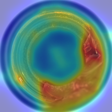

# MLOps layer

This file covers everything outside the detection algorithm: data and model versioning, experiment tracking, the inference service, the human review loop, containerisation, and CI.

---

## The problem this pipeline actually solves

This detection method deploys unlike a normal deep model, with three direct engineering consequences:

1. **There is no weights file.** The "model" = a frozen ImageNet backbone + a memory bank of normal-sample features. So **what gets versioned is data**, not a checkpoint — which is exactly where DVC earns its place.
2. **The artifact is large.** For bottle's 209 training images the feature bank is 561 MB at fp16. It must never go into git.
3. **The threshold is a product decision, not a training outcome.** How much false-negative vs. false-positive risk to accept is a business call, tuned from human labelling feedback — which is why the Streamlit review tool exists.

```
prepare_data ──► evaluate ──► build_bank ──► FastAPI service
     │              │              │              │
    DVC           MLflow          DVC        Streamlit review
 (data version) (experiments)  (model version)  (human feedback)
                                                  │
                                 threshold recalibration ◄───┘
```

---

## 1. DVC: data and model versioning

### Why not git

`data/mvtec_anomaly_detection` is 4.91 GiB across 6 642 files (3 629 training images + 1 725 test images + 1 258 ground-truth masks + a few readme files); `artifacts/banks/spade_bottle.pt` is 561 MB. git cannot hold this. DVC writes the content hash into a small `.dvc` file that git tracks, and keeps the actual bytes in a remote.

### Everyday commands

```bash
dvc status                 # is the workspace consistent with the lock file
dvc repro                  # run the full pipeline per dvc.yaml
dvc metrics show           # read artifacts/runs/<run_name>/metrics.json
dvc metrics diff HEAD~1    # compare metrics against the previous commit
dvc params diff            # compare params.yaml
dvc dag                    # print the stage dependency graph
```

`dvc metrics show` in this repository right now:

```
Path                                       mean_image_rocauc  mean_pixel_rocauc  mean_pixel_pro  n_categories  delta_image_rocauc  delta_pixel_rocauc
artifacts/runs/full-mvtec-k5/metrics.json  85.41              96.44              86.13           15            0.01                0.04
```

### The feature cache: the layer DVC cannot reach

DVC caches at **stage** granularity. Change `top_k` in `params.yaml` and the whole `evaluate` stage re-runs — including the 15 minutes of feature extraction. But features depend only on (dataset, backbone, pre-processing) and have **nothing to do with K or sigma**. Sweeping K therefore recomputes identical tensors a dozen times for nothing.

Hence a second cache layer inside the stage (`src/spade/cache.py`, off by default):

```bash
python -m spade.evaluate --categories all --cache-features
```

Measured: toothbrush hit the cache on a second run with identical results, and feature time fell from 56 s to 20 s (the remaining 20 s is the uncached test split).

Two design choices:

- **Only the train split is cached**, the same choice the public baseline makes. Training is 3 629 of the 5 354 images, the bulk of it; caching the test split would also mean storing the input tensors the localisation figures need, which is not worth it.
- **The cache key covers everything that can change the tensors**: category, split, backbone, layer set, resize/crop, dtype, and the **torch version**. The baseline keys on the class name alone — change the input size and it silently returns features of the wrong shape. `tests/test_cache.py::test_every_input_dimension_changes_the_key` pins this.

The cache size can be computed directly: one training image's four hooked layers at float32 is `256·56² + 512·28² + 1024·14² + 2048` numbers ≈ 5.37 MB, so 3 629 training images total **19.0 GB** (halved to 9.5 GB at float16). Measured: toothbrush's 60 images take 329 MB against the 322 MB computed (the gap is `torch.save` overhead plus labels/masks).

Those 19 GB are in `.gitignore` and stay out of DVC too — they regenerate from the dataset, so there is nothing worth versioning.

### The README result table's self-check had a trap

The README's result table is generated from `results.json` by `scripts/update_readme_results.py`, and CI re-checks it with `--check`. The original `--check` implementation took "the most recently modified `results.json` anywhere under `artifacts/`" — which broke the day a second run directory was added (the gallery-truncation ablation): it compared against the ablation and reported a perfectly correct README as stale.

The fix writes a source marker into the result block:

```html
<!-- source: artifacts/runs/full-mvtec-k5/results.json -->
```

`--check` reads that line to decide what to compare against, so the README is self-describing. The regression test `tests/test_readme_sync.py::test_check_uses_the_declared_run_not_the_newest` verifies both that the marker works *and* that removing it really does produce the false alarm — so the guard is not decorative.

### The git / DVC split

`dvc.yaml` draws the line explicitly with `cache: false`:

- **git owns**: the JSON reports, `results.md`, the ROC curves, the 15 categories' localisation figures — small, readable evidence you want visible on the page;
- **DVC owns**: the 5 GB dataset and the 561 MB feature bank — git sees only a hash.

### The pipeline

`dvc.yaml` defines three stages that re-run only when their dependencies change:

| Stage | Command | Outputs |
| --- | --- | --- |
| `check_data` | `scripts/prepare_data.py --check-only --strict` | — |
| `evaluate` | `python -m spade.evaluate` | `results.json` / `results.md` / `metrics.json` / `roc_curve.png` / `images/` |
| `build_bank` | `scripts/build_bank.py` | `spade_<category>.pt` + calibration metadata |

Change `evaluate.top_k` in `params.yaml` (say from 5 to the paper's 50) and `dvc repro` re-runs only `evaluate` and `build_bank`, not the data verification.

One practical DVC constraint: `dvc.yaml`'s `cmd` has no conditional syntax, so `${evaluate.compute_pro}` can only be expanded unconditionally. That is why `--compute-pro` is implemented to work **both as a bare flag and with a value** (`--compute-pro` / `--compute-pro false`) rather than as a plain `store_true`. `tests/test_cli.py::test_dvc_style_invocation_parses` pins the constraint.

### Remote

The repository ships with an in-repo local remote configured (`.dvcstore`, already gitignored), so a fresh clone works immediately. Switching to object storage in production is a one-line change:

```bash
dvc remote add -d store s3://my-bucket/spade     # or gs:// / azure:// / ssh://
dvc push
```

macOS APFS supports reflinks, and `.dvc/config` sets `cache.type = reflink,hardlink,copy`, so bringing the 5 GB dataset under DVC took 8 seconds and almost no extra disk.

---

## 2. MLflow: experiment tracking

`src/mlops/tracking.py` is a thin wrapper, deliberately **fail-soft**: whether or not MLflow is installed, whether or not its server is reachable, `make eval` must still finish and write `results.json`. Tracking is observation, not a runtime dependency.

Each run records:

- **params**: `top_k`, `backbone`, `resize`/`cropsize`, `device`, torch version, platform
- **metrics**: per-category `image_rocauc` / `pixel_rocauc` / `pixel_pro` for all 15, plus `mean_image_rocauc` / `mean_pixel_rocauc` / `mean_pixel_pro` / `wall_clock_s`
- **artifacts**: the whole run directory (comparison tables, ROC curves, localisation figures)

```bash
make mlflow                                    # UI -> http://localhost:5000
MLFLOW_TRACKING_URI=http://localhost:5000 make eval
```

The default backend is `sqlite:///mlflow.db`, a local file database that needs no server.

> **A trap I hit:** the default started out as `file:./mlruns`. MLflow 3.15 put the plain-file backend into maintenance mode and now raises outright (unless `MLFLOW_ALLOW_FILE_STORE=true`). That accident happened to validate the fail-soft design — when tracking initialisation threw, the 15-category evaluation still ran to completion and wrote `results.json`, leaving just one line in the log: `[spade] MLflow disabled (...)`. Backfilling that run afterwards with `log_existing_run()` cost nothing, instead of re-running 21 minutes.

Backfilling an offline run:

```python
from mlops.tracking import log_existing_run
log_existing_run("artifacts/runs/full-mvtec-k5/results.json")
```

---

## 3. FastAPI: the inference service

```bash
make api        # http://localhost:8000/docs
```

| Endpoint | Purpose |
| --- | --- |
| `GET /health` | Liveness probe + loaded categories |
| `GET /models` | Per-bank metadata and calibration details |
| `GET /stats` | Request count, anomaly count, mean latency |
| `POST /predict?category=bottle` | Score, verdict, base64 heatmap and mask |
| `POST /predict/overlay?category=bottle` | The blended overlay straight back as a PNG |

```bash
curl -s -F 'file=@data/mvtec_anomaly_detection/bottle/test/broken_large/000.png' \
  'http://localhost:8000/predict?category=bottle&include_images=false' | jq
```

Measured (bottle, threshold 6.78):

| Input | image_score | Verdict | Anomalous pixels |
| --- | ---: | --- | ---: |
| `test/good/000.png` | 4.91 | OK | 0.28 % |
| `test/broken_large/000.png` | 10.57 | DEFECT | 23.4 % |

`POST /predict/overlay` returns the overlay directly:



Design points:

- **Lazy loading.** Each category's bank loads on first request and is then cached, guarded by a lock for thread safety. `SPADE_EAGER_LOAD=1` switches to loading everything at startup, which pairs better with a readiness probe in a container.
- **The bank stays out of the image.** It is data, managed by DVC, mounted as a volume. Only the ImageNet weights are baked in, so a cold container never reaches the network.
- **A missing bank returns 404 rather than crashing.** The error message tells you to run `scripts/build_bank.py`.

### Where the thresholds come from

`scripts/build_bank.py` does leave-one-out **inside the training split**: score each training image as a query against its K nearest neighbours excluding itself, obtain the "normal score distribution", and take a percentile as the threshold (image-level P99, pixel-level P99.5 by default). **The test split is never touched**, so the reported ROC-AUC is not contaminated by threshold calibration.

---

## 4. Streamlit: the annotation review tool

```bash
make review     # http://localhost:8501
```

A human-in-the-loop interface: the model proposes a verdict and a defect mask, the inspector confirms or overrides it, and every decision is appended to `artifacts/reviews/reviews.jsonl`.

**Review queue**: input / heatmap / predicted mask / ground-truth mask (test-split samples only) side by side, with the score, threshold, model verdict and anomalous-pixel fraction; the inspector picks `ok` / `defect` / `unsure` and can add a defect type and notes. The threshold sliders in the sidebar show live how verdicts shift with the threshold — that is the core value of this tool.

**Dashboard**: cumulative review count, human/model agreement rate, a confusion matrix with precision/recall/F1 treating the human verdict as truth, and a "disagreements" list — the raw material for re-calibrating the threshold. Exportable as CSV.

Storage is append-only JSONL:

- Two reviewers working at once cannot overwrite each other
- A changed verdict is a new record, not an in-place edit, so history survives intact
- A torn final line does not destroy the file (`load()` skips lines that fail to parse)

`latest_per_image()` takes the last decision per image path as the current state.

Image paths are stored **relative to the repository root**. Absolute paths would make the log useless on any other machine, and would leak the reviewer's home directory into a file that gets shared.

---

## 5. Docker

`docker/Dockerfile` is one multi-stage build with two targets:

```bash
docker build -f docker/Dockerfile --target api    -t spade-api .
docker build -f docker/Dockerfile --target review -t spade-review .
docker compose -f docker/docker-compose.yml up --build    # api + review + mlflow
```

Several deliberate choices:

- **CPU-only torch** (`--index-url https://download.pytorch.org/whl/cpu`). Wheels from the default index drag in about 2 GB of CUDA libraries that are useless in a CPU container. Both images come out at 2.03 GB.
- **ImageNet weights baked in**, so a cold start needs no network.
- **Non-root user** (uid 10001).
- **HEALTHCHECK** pointed at each service's own health endpoint.
- **The bank is mounted read-only**, never baked into the image.

All three services are verified working:

| Service | Check | Result |
| --- | --- | --- |
| `api` | `GET /health`, and `POST /predict` with no bank mounted | ok; 404 rather than a crash |
| `review` | `GET /_stcore/health`, page render, container logs | ok; renders; no errors |
| `mlflow` | `GET /health`, `GET /api/2.0/mlflow/experiments/search` | `OK`; API returns the default experiment |

### Known limitation: a non-ASCII path breaks `docker compose build`

If the repository sits at a path containing non-ASCII characters, `docker compose build` fails before it starts:

```
failed to dial gRPC: rpc error: code = Internal desc = header key
"x-docker-expose-session-sharedkey" contains value with non-printable ASCII char
```

gRPC metadata only accepts printable ASCII (0x20–0x7E), and Compose passes the project path through into that session header. `COMPOSE_BAKE=false` does not help — it is not bake-specific.

This is a Compose/buildx limitation, not a problem with the Dockerfile: `docker build` handles the same path fine, whether the context is given as `.` or as an absolute non-ASCII path. Both were verified.

Two ways around it:

```bash
# 1. Build with docker build, then start without rebuilding
docker build -f docker/Dockerfile --target api    -t spade-api:local .
docker build -f docker/Dockerfile --target review -t spade-review:local .
docker compose -f docker/docker-compose.yml up -d --no-build

# 2. Or simply clone into an ASCII-only path
```

The `image:` keys in `docker-compose.yml` (`spade-api:local`, `spade-review:local`) are named exactly so that option 1 works: Compose picks up the pre-built images instead of building them.

---

## 6. GitHub Actions

`.github/workflows/ci.yml` has three jobs:

| Job | Contents |
| --- | --- |
| `lint` | `ruff check .` |
| `test` | Python 3.11 / 3.12 matrix, runs `pytest -m "not needs_data"`, caches the torch hub weights, emits coverage |
| `docker` | Builds the API image and smoke-tests it: start container → `/health` becomes ready → `/predict` must return 404 while no bank is mounted |

CI has no 5 GB dataset, so tests that need it are marked `needs_data` and skipped; tests that need the backbone are marked `needs_backbone` and get their weights from the cache.

`tests/test_docs_attribution.py` turns the attribution requirements into tests that can fail: the README must mention the paper, the authors, `byungjae89/SPADE-pytorch`, the `NVlabs/SPADE` disambiguation, and the difference between `K=5` and `K=50`. If any document describes the third-party implementation as a release by the paper's authors, CI goes red.

That check comes with a guard for the guard: `test_the_attribution_guard_actually_catches_a_bare_claim` ensures the regexes have not been loosened. Documents are allowed to **quote** the wrong phrasing as a warning (detected via negation cues in the surrounding context), but not to assert it.
